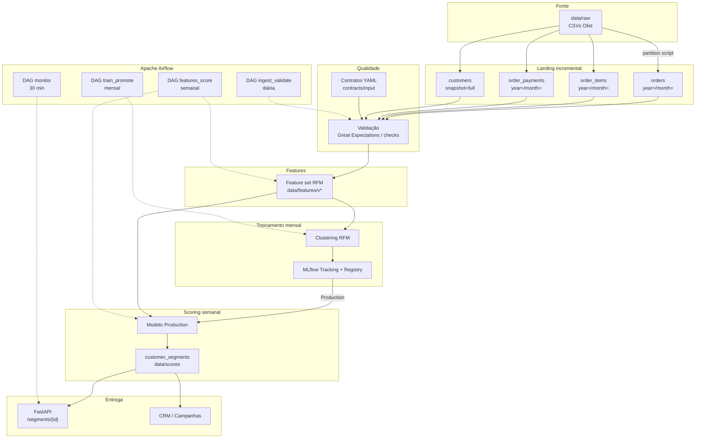

# Diagrama da arquitetura — Segmentação de clientes (MLOps)

## Fluxo resumido

1. **Ingestão diária** lê a partição do mês corrente e valida contratos.  
2. **Features + scoring semanal** regeneram RFM e publicam segmentos.  
3. **Treino mensal** retreina, registra no MLflow e promove só se passar nos gates.  
4. **API / CRM** consomem `customer_segments` com rastreio de `model_version` e `feature_set_version`.
